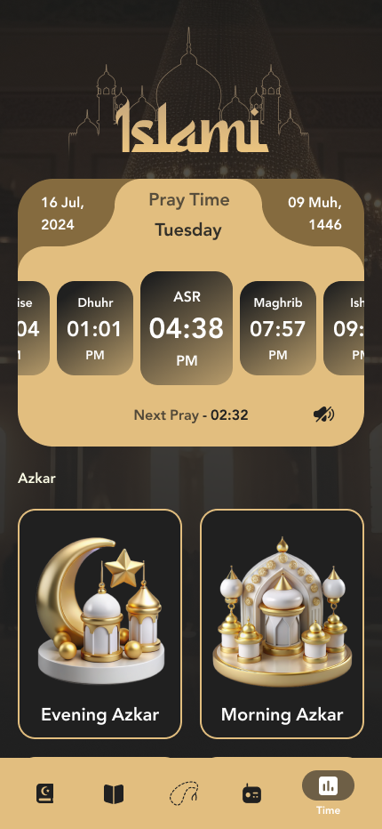

# Islami 🌙

<p align="center">
  
</p>

## Description
A simple Islamic app that contains multiple religious sections such as **Azkar**, **Hadith**, **Sebha**, **Radio**, and **Prayer Times**.  
Built with **Flutter** 🎯.


## Getting Started

### Dependencies 📦

This project uses the following packages:

- [cupertino_icons](https://pub.dev/packages/cupertino_icons) – iOS style icons
- [flutter_svg](https://pub.dev/packages/flutter_svg) – Render SVG files
- [animate_do](https://pub.dev/packages/animate_do) – Pre-built animations
- [shared_preferences](https://pub.dev/packages/shared_preferences) – Store simple key-value data locally
- [smooth_page_indicator](https://pub.dev/packages/smooth_page_indicator) – Customizable page indicators

### Dev Dependencies 🛠
- [flutter_test](https://pub.dev/packages/flutter_test) – Testing framework for Flutter
- [flutter_lints](https://pub.dev/packages/flutter_lints) – Recommended lints for Flutter projects

### Installing

Run these commands in your terminal:
#### 1. Open Terminal and Clone the Repo
```bash
git clone https://github.com/omararameen77/islami.git
```
#### 2. Cd Over
```bash
cd islami
```
#### 3 .Run Pub
```bash
flutter pub get
```
## Help

This App is using **SharedPreferences** To get the Data From Local Data Source

## Authors

```bash
Omar Ameen
```
## Images

```bash
images
```

<p align="left">
  
  
  
  
  
  
  
  
  
  
  
</p>
<p align="left">
  
  
  
</p>
